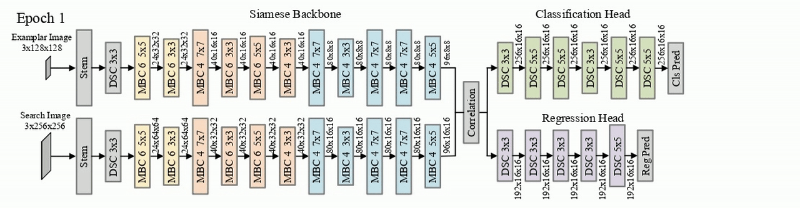
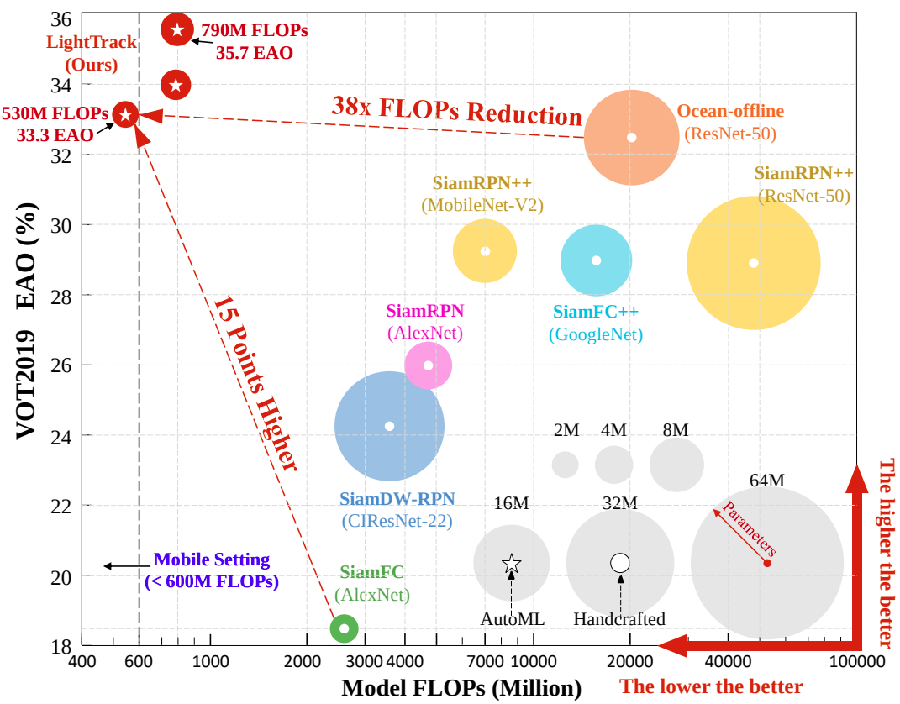

# LightTrack: Finding Lightweight Neural Networks for Object Tracking via One-Shot Architecture Search

<div align="center">
  
</div>

The official implementation of the paper 

[**LightTrack: Finding Lightweight Neural Networks for Object Tracking via One-Shot Architecture Search**](https://arxiv.org/abs/2104.14545)

Hiring research interns for visual transformer projects: houwen.peng@microsoft.com
## Abstract

We present LightTrack, which uses neural architecture search (NAS) to design more lightweight and efficient object trackers. Comprehensive experiments show that our LightTrack is effective. It can find trackers that achieve superior performance compared to handcrafted SOTA trackers, such as SiamRPN++ and Ocean, while using much fewer model Flops and parameters. Moreover, when deployed on resource-constrained mobile chipsets, the discovered trackers run much faster. For example, on Snapdragon 845 Adreno GPU, LightTrack runs 12× faster than Ocean, while using 13× fewer parameters and 38× fewer Flops. Such improvements might narrow the gap between academic models and industrial deployments in object tracking task.

<div align="center">
  
</div>

## Environment Installation
```
cd lighttrack
conda create -n lighttrack python=3.6
conda activate lighttrack
bash install.sh
```
## Data Preparation
- Tracking Benchmarks

Please put VOT2019 dataset under `$LightTrack/dataset`. The prepared data should look like:
```
$LighTrack/dataset/VOT2019.json
$LighTrack/dataset/VOT2019/agility
$LighTrack/dataset/VOT2019/ants1
...
$LighTrack/dataset/VOT2019/list.txt
```
## Test and evaluation
Test LightTrack-Mobile on VOT2019
```
bash tracking/reproduce_vot2019.sh
```
## Flops, Params, and Speed
Compute the flops and params of our LightTrack-Mobile. The flops counter we use is [pytorch-OpCounter](https://github.com/Lyken17/pytorch-OpCounter)
```
python tracking/FLOPs_Params.py
```
Test the running speed of our LightTrack-Mobile
```
python tracking/Speed.py
```
